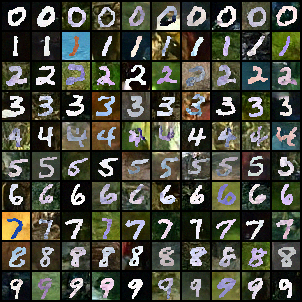
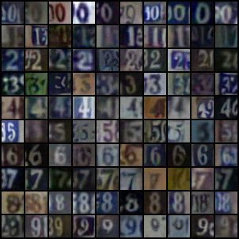
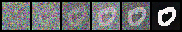
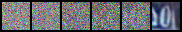
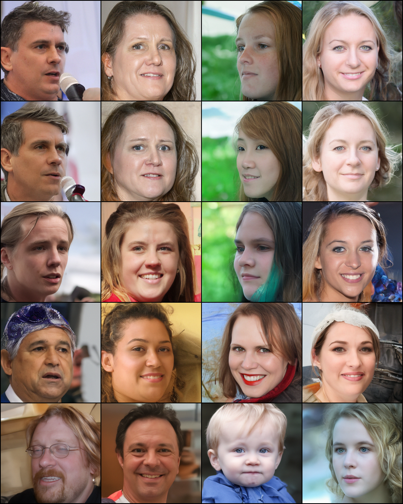
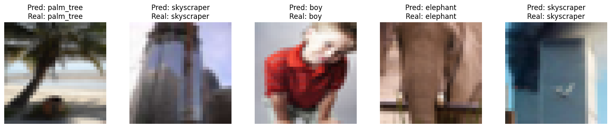
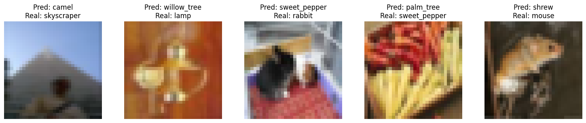
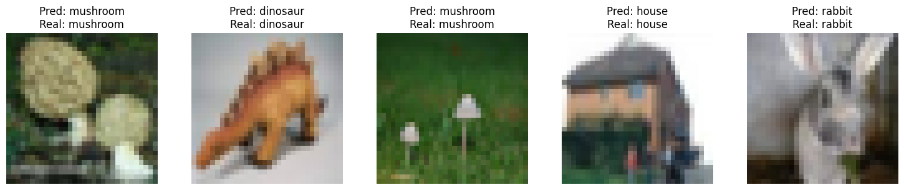
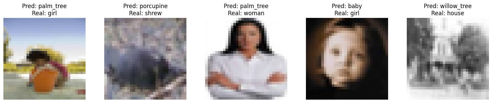
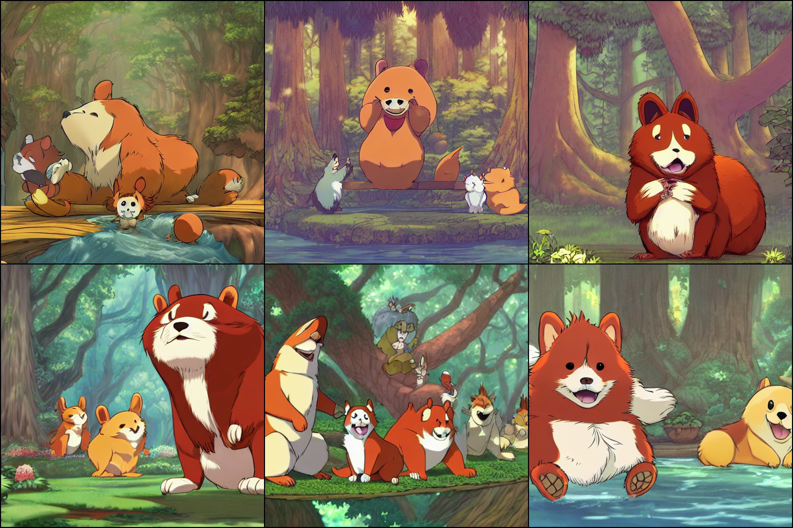

# DLCV HW2 report
## Problem 1
1. Describe your implementation details and the difficulties you encountered.
> 模型
>> 將condition 通過通過embedding的方式嵌入到Unet中, 通過mask控制要使用condition還是unconditional
> 其餘部分與普通UNet一樣
>
> training 方法
>> 與ddpm的區別為會加入隨機抹除condition的mask使其變為unconditional
> 
> sample 方法
>> 通過classifier-free guidance 論文的方式先將初始值複製成兩份，一份做condition另一份做uncondition之後將兩份通過公式```(1+guide_w) * eps1 - guide_w * eps2``` 將其做linear interpolation後當做eps使用
> 
> 遇到的問題
>> 忘記把model改成model.eval()導致batchnorm 不穩定無法成功sample

2. Please show 10 generated images for each digit (0-9) from both MNIST-M & SVHN dataset in your report. You can put all 100 outputs in one image with columns indicating different noise inputs and rows indicating different digits. [see the below MNIST-M example, you should visualize BOTH MNIST-M & SVHN]
> mnistm
>> 
>
> svhn
>> 

3. Visualize a total of six images from both MNIST-M & SVHN datasets in the reverse process of the first “0” in your outputs in (2) and with different time steps. [see the MNIST-M example below, but you need to visualize BOTH MNIST-M & SVHN]
> mnistm
>> 
>
> svhn
>> 

## Problem 2
1. Please generate face images of noise 00.pt ~ 03.pt with different eta in one grid. Report and explain your observation in this experiment.
> 
> 當eta越大圖片越有多樣性

2. Please generate the face images of the interpolation of noise 00.pt ~ 01.pt. 
The interpolation formula is spherical linear interpolation, which is also known as slerp. 
> simply linear interpolation (formula: alpha * x1 + beta * x2) Noted: beta = 1 - alpha
>> 
>
> spherical linear interpolation
>> 
>
> 根據上面兩張圖可以觀察到單純使用簡單的linear會導致在alpha 0.2 ~ 0.8 之間的圖片無法很好的融合在一起。而使用spherical linear interpolation方式過度則可以有很好的過渡性、平滑性。

## Problem 3
1. Conduct the CLIP-based zero shot classification on the hw2_data/clip_zeroshot/val, explain how CLIP do this, report the accuracy and 5 successful/failed cases.

> ViT-L/14
>> accuracy:  0.7692
>>> Experimentally
>>>> Success:
>>>>> 
>>>>
>>>> Failure:
>>>>> 
>
> ViT-B/32
>> accuracy:  0.5648
>>> Experimentally
>>>> Success:
>>>>> 
>>>>
>>>> Failure:
>>>>> 

2. What will happen if you simply generate an image containing multiple concepts (e.g., a \<new1> next to a \<new2>)? You can use your own objects or the provided cat images in the dataset. Share your findings and survey a related paper that works on multiple concepts personalization, and share their method.
> 在P3中的模型中所生成的結果。 ```Noted：<new1>: dog <new2>: David Revoy```
>> prompt: A \<new1> next to a cat
>>> 
>
>> prompt: a photo of \<new1> in style of \<new2>.
>>> 
>
> 可以看到用P3的單獨訓練embedding的方式會導致無法多個object同時存在於一張圖中, 但對於object與style融合的情況下看起來還行。

> 嘗試的方法將兩個資料集一起train，在計算loss時不僅僅計算一個object的loss，而是多個loss，在這裡使用了\<new1>以及\<new2>一起放進去訓練。並且盡可能的少train不然會無法同時出現兩個物件```Noted：<new1>: dog <new2>: cat```
>> 將cat換成\<new2> 重train
>>> 
>>> 上述實驗只能部分出現貓，或貓狗合體

> 找到的paper（其他方法）
>> [Multi-Concept Customization of Text-to-Image Diffusion](https://openaccess.thecvf.com/content/CVPR2023/papers/Kumari_Multi-Concept_Customization_of_Text-to-Image_Diffusion_CVPR_2023_paper.pdf)